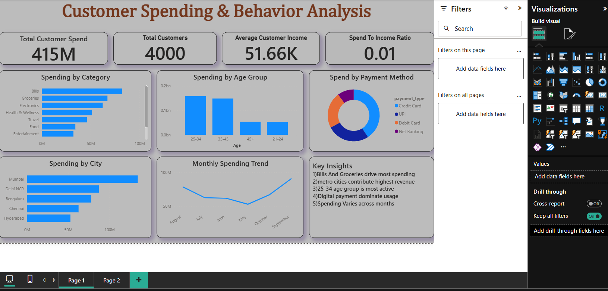
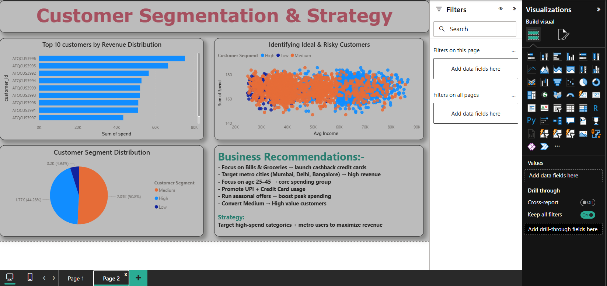

#  Credit Card Strategy Analysis

## About the Project
I worked on this project to understand how a bank can use customer data to improve its credit card strategy.  
The idea was simple — find who spends more, who is risky, and how the bank can make better decisions.

---

## What I Tried to Answer

*1.Who are the most valuable customers?*  
From the data, customers with higher income and higher spending are clearly the most valuable.  
They contribute a big chunk of total revenue.

*2.Where do customers spend the most?*  
Most of the money is spent on Bills and Groceries.  
Other categories like entertainment or travel are lower in comparison.

*3.Who are ideal for credit cards?*  
Customers earning around 60K+ with consistent spending look like the best targets.  
They are likely to use the card regularly.

*4.Which customers are risky?*  
Some customers have low income but still spend a lot.  
These users can be risky because repayment might be an issue.

*5.Which segment is most profitable?*  
High-value customers generate most of the revenue.  
But medium segment is also important because they can be converted into high-value users.

*6.What kind of credit card should be launched?*  
Based on spending patterns, cashback cards on Bills and Groceries make the most sense.

---

## What I Recommend

- Focus more on Bills & Groceries (highest spending areas)  
- Target metro cities like Mumbai, Delhi NCR, Bangalore  
- Focus on age group 25–45 (most active users)  
- Try to convert medium users into high-value customers  
- Keep stricter checks on risky customers  

---

## Tools I Used
- Python (Pandas) for analysis  
- Power BI for dashboard  

---

## Dashboard

### Page 1

### Page 2

---

## Final Thought
This project helped me understand how raw data can actually be used to take business decisions.  
Instead of just making charts, I tried to think from a bank's perspective.
